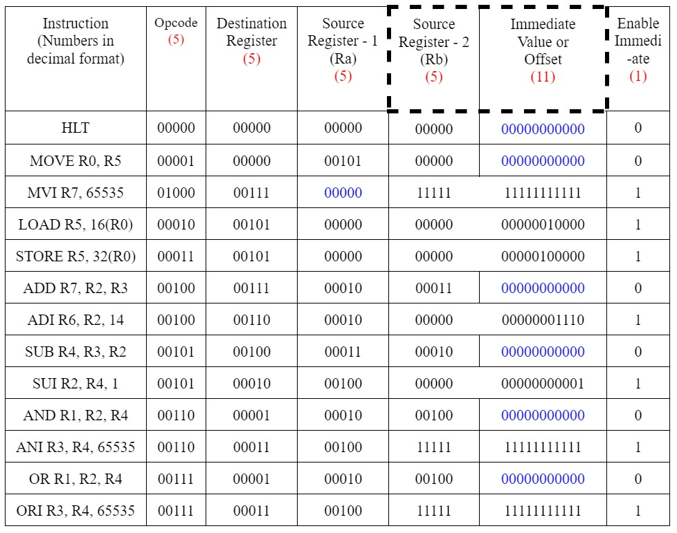

<h1 align = "center"> 32-bit Processor Design </h1>
<h3 align="center"> CS3L002 - Computer Organization and Architecture </h3>
<h5 align="center"> Project Assignment - <a href="https://www.iitbbs.ac.in/">IIT Bhubaneswar</a> (Autumn 2021) </h5>

 

I have designed and implemented a 32-bit Reduced Instruction Set Computer(RISC) using <a href="http://www.cburch.com/logisim/">LogiSim</a>.

<h2> 🌟 Functionalities </h2>

The processor supports the following Assembly Instructions: - 

<ul>
<li> MOVE Ri, Rj: The content of Rj is transferred to Ri. </li>
<li> MOVE Ri, Immediate (16-bit): The immediate value (32-bit unsigned extended) will be transferred to Ri.</li>
<li> LOAD Ri, X (Rj): The content of memory location [[Rj] + X] is loaded into Ri, where X is a 16-bit unsigned immediate value.</li>
<li> STORE Ri, X (Rj): The content of register Ri is stored in memory [[Rj] + X], where X is a 16-bit unsigned immediate value.</li>
<li> ADD Ri, Rj, Rk:   Ri = Rj + Rk</li>
<li> ADI Ri, Rj, Immediate (16-bit):   Ri = Rj + Immediate Value (32-bit unsigned extended)</li>
<li> SUB Ri, Rj, Rk:  Ri = Rj - Rk</li>
<li> SUI Ri, Rj, Immediate (16-bit):   Ri = Rj - Immediate Value (32-bit unsigned extended)</li>
<li> AND Ri, Rj, Rk:   Ri = Rj AND Rk</li>
<li> ANI Ri, Rj, Immediate (16-bit):   Ri = Rj AND Immediate Value (32-bit unsigned extended)</li>
<li> OR Ri, Rj, Rk:  Ri = Rj OR Rk</li>
<li> ORI Ri, Rj, Immediate (16-bit):  Ri = Rj OR Immediate Value (32-bit unsigned extended)</li>
<li> HLT: Stops the execution</li>
  
</ul>

<h2> 🤖 Overall Architecture </h2>

<table>
  <tr>
    <th>Units</th>
    <th>Description</th>
  </tr>
  <tr>
    <td>General Purpose Registers</td>
    <td>8 <em>(R0 - R7)</em></td>
  </tr>
  <tr>
    <td>Special Purpose Registers</td>
    <td>7 <em>(PC, IR, RA, RB, RZ, RM, RY)</em></td>
  </tr>
  <tr>
    <td>Address Bit Width</td>
    <td>16</td>
  </tr>
   <tr>
    <td>Data Bit Width</td>
    <td>32</td>
  </tr>
  <tr>
    <td>Random Access Memory(RAM)</td>
    <td>8 MB</td>
  </tr>
  <tr>
    <td>Clock cycles per instruction</td>
    <td>5</td>
  </tr>
  <tr>
    <td>Number of supported instructions</td>
    <td>13</td>
  </tr>
</table>

<h2> Instruction Encoding </h2>
<ul>
<li>The Encoding format is of 32-bit size (which goes in accordance with the guidelines of RISC - 32 processor).</li> 
  
  <li>The <b>opcode</b> for any instruction is given by the first five bits of the encoding. (More about opcodes in assembler table section).</li> 
  
<li>The next five bits after the opcode represents the destination register (Rc), that is in which register you would like to write back your information.</li> 
  
<li>The next five bits after the destination register signifies the source register - 1 (Ra), that is from which register of the Register file, you want to load your values into Register Ra.</li> 
  
  <li> <b>( Overlapping ) </b> Depending on the fact that, whether your instruction makes use of immediate value/ offset, the next 16 bits are decided.
<ol>
  <li> <em>Case 1 (When no immediate value or offset is present)</em> :- In this case, the first five bits out of 16 bits, signifies the source register - 2(Rb),  that is from which register of the Register File, you want to load your values into Register Rb. The remaining bits are kept at zero. </li>
  <li> <em>Case 2 (When immediate value or offset is present)</em> :- In this case, the next 16 bits, signifies the immediate value or the offset, needed for the operation.</li> 
</ol>
  
<li>At last, we have one bit that signifies Enable Immediate or Offset. It means that if any instruction makes use of an offset value or an immediate value, then this bit is set to 1, else it is set to zero (0).</li> 
  </ul>
  

 

<h2> Register File Encoding </h2>

<ul>
  <li> The 32 - bit RISC processor, comprises of eight(8) General Purpose Registers, which are present inside the register file.</li> 
  <li> Each register is represented from R0 - R7. (Ri means ith register). </li>
</ul>
 

<table>
  <tr>
    <th>Register</th>
    <th>Encoding for Select Register (5 - bit)</th>
  </tr>
  <tr>
    <td>R0</td>
    <td>00000</td>
  </tr>
  <tr>
    <td>R1</td>
    <td>00001</td>
  </tr>
  <tr>
    <td>R2</td>
    <td>00010</td>
  </tr>
  <tr>
    <td>R3</td>
    <td>00011</td>
  </tr>
  <tr>
    <td>R4</td>
    <td>00100</td>
  </tr>
  <tr>
    <td>R5</td>
    <td>00101</td>
  </tr>
  <tr>
    <td>R6</td>
    <td>00110</td>
  </tr>
  <tr>
    <td>R7</td>
    <td>00111</td>
  </tr>
</table>
  

<h2> Operation Encoding </h2>
<ul>
  <li>The 32 - bit RISC processor designed by me, works in total for 13 assembly instructions.</li> 
  <li>Each operation is identified by a 5-bit Opcode and 1 bit of Enable Immediate or Offset.</li> 
</ul>

| **Operation   (Full Name)** | **Operation  (Short form)** | **Opcode   (5 bits)** | **Enable Immediate   (1 bit)** |
| ---- | ----- | ----- | ----- |
| Halt | HLT | 00000 | 0 | 
| Move | MOV | 00001 | 0 |
| Move Immediate | MVI | 01000 | 1 |
| Load | LOAD | 00010 | 1 |
| Store | STORE | 00011 | 1 |
| Addition | ADD | 00100 | 0 |
| Addition Immediate | ADI | 00100 | 1 |
| Subtract | SUB | 00101 | 0 |
| Subtract Immediate | SUI | 00101 | 1 |
| And | AND | 00110 | 0 |
| And Immediate | ANI | 00110 | 1 |
| Or  | OR | 00111 | 0 |
| Or Immediate | ORI | 00111 | 1 |

<h2> Immediate Value Encoding </h2>

<ul>
  <li>If the operation makes use of an immediate value or an offset, then the enable immediate value or offset bit is set to 1.</li> 
  <li>The immediate value is represented using 16 bits, which are overlapped with source register - 2.</li> 
  <li>For example, if X or offset is 7 (in decimal), then it is represented as - 0000 0000 0000 0111</li> 
</ul>

<h2> Sample Encodings </h2>

1.  The instruction should be written in the same order as given below, from **left to right**. Program Counter always starts from 0.

2.  In the below example, for the instruction column, I am representing the offset or the immediate value in decimal format. It is converted into binary format in the immediate value column.  

3.  The following image goes through one example of each instruction, and tells how to represent it in my encoding format (32 - bit encoding). 

 

