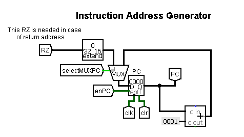
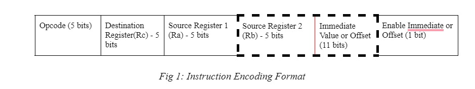
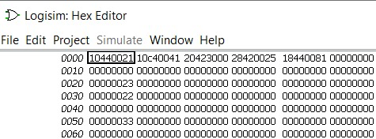

<h1 align = "center"> RISC Processor and Compiler Integration </h1>
<h3 align="center"> CS3L002 - Computer Organization and Architecture </h3>
<h5 align="center"> Project Assignment - <a href="https://www.iitbbs.ac.in/">IIT Bhubaneswar</a> (Autumn 2021) </h5>

 

I have designed and implemented a 32-bit Reduced Instruction Set Computer(RISC) using <a href="http://www.cburch.com/logisim/">LogiSim</a>.

<h2 id="content"> 📝 Contents </h2>

 1. [Functionalities](#func)
 2. [Overall Architecture](#architecture)
 3. [Components](#components)
 4. [Five Stage Architecture](#five)
 5. [Instruction Encoding](#instruction)
 6. [Register File Encoding](#register)
 7. [Operation Encoding](#operation)
 8. [Immediate Value Encoding](#immediate)
 9. [Sample Encodings](#sample)
 10. [Encoded Instructions in Memory(or RAM)](#encoded)
 11. [Program Execution Examples](#program)
 12. [Usage Instructions](#usage)
 13. [Credits](#credits)

<h2 id="func"> 🌟 Functionalities </h2>

The processor supports the following Assembly Instructions: - 

<ul>
<li> MOVE Ri, Rj: The content of Rj is transferred to Ri. </li>
<li> MOVE Ri, Immediate (16-bit): The immediate value (32-bit unsigned extended) will be transferred to Ri.</li>
<li> LOAD Ri, X (Rj): The content of memory location [[Rj] + X] is loaded into Ri, where X is a 16-bit unsigned immediate value.</li>
<li> STORE Ri, X (Rj): The content of register Ri is stored in memory [[Rj] + X], where X is a 16-bit unsigned immediate value.</li>
<li> ADD Ri, Rj, Rk:   Ri = Rj + Rk</li>
<li> ADI Ri, Rj, Immediate (16-bit):   Ri = Rj + Immediate Value (32-bit unsigned extended)</li>
<li> SUB Ri, Rj, Rk:  Ri = Rj - Rk</li>
<li> SUI Ri, Rj, Immediate (16-bit):   Ri = Rj - Immediate Value (32-bit unsigned extended)</li>
<li> AND Ri, Rj, Rk:   Ri = Rj AND Rk</li>
<li> ANI Ri, Rj, Immediate (16-bit):   Ri = Rj AND Immediate Value (32-bit unsigned extended)</li>
<li> OR Ri, Rj, Rk:  Ri = Rj OR Rk</li>
<li> ORI Ri, Rj, Immediate (16-bit):  Ri = Rj OR Immediate Value (32-bit unsigned extended)</li>
<li> HLT: Stops the execution</li>
  
</ul>

<h2 id="architecture"> 🤖 Overall Architecture </h2>

<table>
  <tr>
    <th>Units</th>
    <th>Description</th>
  </tr>
  <tr>
    <td>General Purpose Registers</td>
    <td>8 <em>(R0 - R7)</em></td>
  </tr>
  <tr>
    <td>Special Purpose Registers</td>
    <td>7 <em>(PC, IR, RA, RB, RZ, RM, RY)</em></td>
  </tr>
  <tr>
    <td>Address Bit Width</td>
    <td>16</td>
  </tr>
   <tr>
    <td>Data Bit Width</td>
    <td>32</td>
  </tr>
  <tr>
    <td>Random Access Memory(RAM)</td>
    <td>256 KB</td>
  </tr>
  <tr>
    <td>Clock cycles per instruction</td>
    <td>5</td>
  </tr>
  <tr>
    <td>Number of supported instructions</td>
    <td>13</td>
  </tr>
</table>

<h2 id="components"> 💾 Components </h2>

### 1. **Block Diagram of Five Stage Architecture**

  
### 2. **Five Stage Pipeline**

### 3. **Arithmetic Logic Unit**

### 4. **Register File Block**

### 5. **Control Unit**

### 6. **Instruction Address Generator**

### 7. **Processor Memory Interface**

### 8. **RESET Block**

<h2 id="five"> :book: Five Stage Architecture </h2>

<ul>
  <li> Fetch: The instruction pointed by Program Counter is fetched from Random Access Memory and transmitted to the Instruction Register (IR).</li>
<li> Decode: Instruction Register transfers the value of instruction for decode inside the control unit, which further generates the control signals needed for handling the operation. In my circuit, I am making use of 14 control signals, each one required to handle different blocks and components mentioned above. 
  <ul>
  <li> Register File is controlled by the following signals: select_RA, select_RB, select_RC, enRewrite, and store.</li>
    <li> The arithmetic and Logical Unit is controlled by ALU_select.</li>
    <li> Processor Memory Interface is controlled by - select_MUXA, and memEnable, memLoadStore</li>
    <li> Instruction Address Generator is controlled by - select_MUXPC and enPC</li>
    <li> Other Signals: select_MUXB, select_MUXY and Immediate </li>
  </ul>
  </li>
<li> Execute: According to the control signals generated by the control unit, the instructions are executed by the ALU (OR, AND, ADD and SUB).</li>
<li> Memory: If Load/Store is to be performed, then the result produced by ALU interacts with memory for the operation, else it is transferred to Register RY.</li>
<li> Writeback: If write mode is enabled in Register File, then the values present in register RY, are written to the RF. This is needed in the case of ADD, ADI, SUB, SUI, AND, ANI, OR, ORI, MOV, MVI and LOAD.</li>
</ul>

<h2 id="instruction"> :twisted_rightwards_arrows: Instruction Encoding </h2>
<ul>
<li>The Encoding format is of 32-bit size (which goes in accordance with the guidelines of RISC - 32 processor).</li> 
  
  <li>The <b>opcode</b> for any instruction is given by the first five bits of the encoding. (More about opcodes in assembler table section).</li> 
  
<li>The next five bits after the opcode represents the destination register (Rc), that is in which register you would like to write back your information.</li> 
  
<li>The next five bits after the destination register signifies the source register - 1 (Ra), that is from which register of the Register file, you want to load your values into Register Ra.</li> 
  
  <li> <b>( Overlapping ) </b> Depending on the fact that, whether your instruction makes use of immediate value/ offset, the next 16 bits are decided.
<ol>
  <li> <em>Case 1 (When no immediate value or offset is present)</em> :- In this case, the first five bits out of 16 bits, signifies the source register - 2(Rb),  that is from which register of the Register File, you want to load your values into Register Rb. The remaining bits are kept at zero. </li>
  <li> <em>Case 2 (When immediate value or offset is present)</em> :- In this case, the next 16 bits, signifies the immediate value or the offset, needed for the operation.</li> 
</ol>
  
<li>At last, we have one bit that signifies Enable Immediate or Offset. It means that if any instruction makes use of an offset value or an immediate value, then this bit is set to 1, else it is set to zero (0).</li> 
  </ul>
  

 

<h2 id="register"> :twisted_rightwards_arrows: Register File Encoding </h2>

<ul>
  <li> The 32 - bit RISC processor, comprises of eight(8) General Purpose Registers, which are present inside the register file.</li> 
  <li> Each register is represented from R0 - R7. (Ri means ith register). </li>
</ul>
 

<table>
  <tr>
    <th>Register</th>
    <th>Encoding for Select Register (5 - bit)</th>
  </tr>
  <tr>
    <td>R0</td>
    <td>00000</td>
  </tr>
  <tr>
    <td>R1</td>
    <td>00001</td>
  </tr>
  <tr>
    <td>R2</td>
    <td>00010</td>
  </tr>
  <tr>
    <td>R3</td>
    <td>00011</td>
  </tr>
  <tr>
    <td>R4</td>
    <td>00100</td>
  </tr>
  <tr>
    <td>R5</td>
    <td>00101</td>
  </tr>
  <tr>
    <td>R6</td>
    <td>00110</td>
  </tr>
  <tr>
    <td>R7</td>
    <td>00111</td>
  </tr>
</table>
  

<h2 id="operation"> :twisted_rightwards_arrows: Operation Encoding </h2>
<ul>
  <li>The 32 - bit RISC processor designed by me, works in total for 13 assembly instructions.</li> 
  <li>Each operation is identified by a 5-bit Opcode and 1 bit of Enable Immediate or Offset.</li> 
</ul>

| **Operation   (Full Name)** | **Operation  (Short form)** | **Opcode   (5 bits)** | **Enable Immediate   (1 bit)** |
| ---- | ----- | ----- | ----- |
| Halt | HLT | 00000 | 0 | 
| Move | MOV | 00001 | 0 |
| Move Immediate | MVI | 01000 | 1 |
| Load | LOAD | 00010 | 1 |
| Store | STORE | 00011 | 1 |
| Addition | ADD | 00100 | 0 |
| Addition Immediate | ADI | 00100 | 1 |
| Subtract | SUB | 00101 | 0 |
| Subtract Immediate | SUI | 00101 | 1 |
| And | AND | 00110 | 0 |
| And Immediate | ANI | 00110 | 1 |
| Or  | OR | 00111 | 0 |
| Or Immediate | ORI | 00111 | 1 |

<h2 id="immediate"> :twisted_rightwards_arrows: Immediate Value Encoding </h2>

<ul>
  <li>If the operation makes use of an immediate value or an offset, then the enable immediate value or offset bit is set to 1.</li> 
  <li>The immediate value is represented using 16 bits, which are overlapped with source register - 2.</li> 
  <li>For example, if X or offset is 7 (in decimal), then it is represented as - 0000 0000 0000 0111 (16-bits_ in total for immediate values)</li> 
</ul>

<h2 id="sample"> :twisted_rightwards_arrows: Sample Encodings </h2>

1.  The instruction should be written in the same order as given below, from **left to right**. Program Counter always starts from 0.

2.  In the below example, for the instruction column, I am representing the offset or the immediate value in decimal format. It is converted into binary format in the immediate value column.  

3.  I will now go through one example of each instruction, and tell how to represent it in my encoding format (32 - bit encoding). 

| **Instruction**| **Opcode   (5 bits)** | **Destination Register   (5 bits)** | **Source Register - 1 (Ra)   (5 bits)** | **Source Register - 2 (Rb)   (5 bits)** | **Immediate Value or Offset   (11 bits)** | **Enable Immediate   (1 bit)** |
| --------------- | ------- | --------- | ---------- | --------- | --------- | ------- |
| HLT | 00000 | 00000 | 00000 | 00000 | 00000000000 | 0 |
| MOVE R0, R5 | 00001 | 00000 | 00101 | 00000 | 00000000000 | 0 |
| MVI R7, 65535 | 01000 | 00111 | 00000 | 11111 | 11111111111 | 1 |
| LOAD R5, 16(R0) | 00010 | 00101 | 00000 | 00000 | 00000010000 | 1 |
| STORE R5, 32(R0) | 00011 | 00101 | 00000 | 00000 | 00000100000 | 1 |
| ADD R7, R2, R3 | 00100 | 00111 | 00010 | 00011 | 00000000000 | 0 |
| ADI R6, R2, 14 | 00100 | 00110 | 00010 | 00000 | 00000001110 | 1 |
| SUB R4, R3, R2 | 00101 | 00100 | 00011 | 00010 | 00000000000 | 0 |
| SUI R2, R4, 1 | 00101 | 00010 | 00100 | 00000 | 00000000001 | 1 |
| AND R1, R2, R4 | 00110 | 00001 | 00010 | 00100 | 00000000000 | 0 |
| ANI R3, R4, 65535 | 00110 | 00011 | 00100 | 11111 | 11111111111 | 1 |
| OR R1, R2, R4 | 00111 | 00001 | 00010 | 00100 | 00000000000 | 0 |
| ORI R3, R4, 65535 | 00111 | 00011 | 00100 | 11111 | 11111111111 | 1 |

<h2 id="encoded"> :twisted_rightwards_arrows: Encoded instructions in memory (or RAM) </h2>

<ul>
  <li> We did convert our instructions into 32-bit binary format, but inside RAM(memory), the data is stored in hexadecimal format.</li> 
  <li> The RAM which I have used, has address bit width of 16 and data bit width of 32. </li> 
  <li> The instructions covered in <a href="#sample">Sample Encodings</a> section, will now be converted into Hexadecimal format, so that they can be loaded into the RAM for processing. </li> 
</ul>

| **Instruction   (Numbers in decimal format)** | **Hexadecimal Encoding    (For memory/ RAM)** |
| ---------------| -------------- |
| HLT | 0x00000000  |
| MOVE R0, R5 | 0x080a0000 |
| MVI R7, 65535 | 0x41c1ffff |
| LOAD R5, 16(R0) | 0x11400021 |
| STORE R5, 32(R0) | 0x19400041 |
| ADD R7, R2, R3 | 0x21c43000 |
| ADI R6, R2, 14 | 0x2184001d |
| SUB R4, R3, R2 | 0x29062000 |
| SUI R2, R4, 1 | 0x28880003 |
| AND R1, R2, R4 | 0x30444000 |
| ANI R3, R4, 65535 | 0x30c9ffff |
| OR R1, R2, R4 | 0x38444000 |
| ORI R3, R4, 65535 | 0x38c9ffff |

<h2 id="program"> 📚 Program Execution Examples </h2>

### **A = B + C – Immediate**

Assuming R2 has the base address of the data and is loaded with 0x10(start), B = 0x23 at 0x20 address in RAM, C = 0x22 at 0x30 address in RAM, and Immediate = 0x12. Final result is stored at memory location 0x50.

| **Address** | **Machine Code** | **Assembly Code** |
| --- | --- | --- |
| 0000 | Load R1, X(R2); Loads B | 10440021 |
| 0001 | Load R3, Y(R2); Loads C | 10c40041 |
| 0002 | Add R1, R1, R3; Adds B+C | 20423000 |
| 0003 | Sui R1, R1, #Immediate; Subtracts Immediate from (B+C) | 28420025 |
| 0004 | Store R1, Z(R2); Stores result in A | 18440081 |
| 0005 | HLT; Halts execution | 00000000 |

Memory image of this program is [here](memory-images/RAM_Load_first_program).

### **A = (B OR C) AND Immediate**

Assuming R2 has the base address of the data and is loaded with 0x10(start), B = 0x15 at 0x20 address in RAM, C = 0x23 at 0x30 address in RAM, and Immediate = 0x42. Final result is stored at memory location 0x50 inside RAM.

| **Address** | **Machine Code** | **Assembly Code** |
| --- | --- | --- |
| 0000 | Load R1, X(R2); Loads B | 10440021 |
| 0001 | Move R3, R1; Moves R1 to R3 | 08c20000 |
| 0002 | Loads R1, Y(R2); Loads C | 10440041 |
| 0003 | Move R4, R1; Moves R1 to R4 | 09020000 |
| 0004 | OR R1, R3, R4; Performs OR of R3 and R4 | 38464000 |
| 0005 | ANI R5, R1, #Immediate; Performs AND with Immediate | 31420085 |
| 0006 | Store R5, Z(R2); Stores the result in A | 19440081 |
| 0007 | HLT; Halts execution | 00000000 |

Memory image of this program assuming R2 having value 0110, is [here](memory-images/RAM_Load_second_program).

<h2 id="usage"> 📋 Usage Instructions </h2>

1. Clone this repository using
`git clone https://github.com/harshsingh-24/32-bit-RISC-processor.git` or downloading the zip-file.
2. Open the processor.circ file in LogiSim.
3. Click on the **RESET** button to clear any previous data inside the processor.
4.	Using <a href="#instruction">Instruction Encoding</a>, <a href="#operation">Operation Encoding</a>, <a href="#register">Register File Encoding</a> and <a href="#sample">Sample Encodings</a>, convert each of your instruction into corresponding hexadecimal value.
5. Load instructions into memory - as told in the encoding formats, instruction inside memory is represented in hexadecimal format. Program counter starts at the address 0000 of the memory. Therefore, load instructions from address 0000 inside the main memory.
6. Right-click on RAM and select “Edit Contents” for inserting into memory. (Enter Hexadecimal values). It should look like this -

  

7. After loading the instructions in RAM, press the System clock to start executing the instructions. You will have to press manually, every time when you want to change the current state of executing the instruction. The changes are always reflected at the rising edge of the clock cycle. 
8. Press 10 times on the clock, in order to completely execute the instruction inside the five-stage pipeline. 
9. At every stage, using the **“Show simulation hierarchy”** option, you can check the state of execution which means what is the state of the Register File, which control signals are generated, which operation is being executed by the ALU and so on.
10. After pressing the system clock 10 times, your Program Counter will get incremented.

***Kudos !! You have successfully executed your first instruction present at the 0000 address location. Want to execute more instructions?***

11. If yes, then repeat the same process from **step 3**. After you have successfully executed all the instructions, if you want to run a different program, then you will have to use the Memory clear and Reset button before loading a new program.

**Note**: Make sure the instructions and data fed to the memory and registers are in the hexadecimal format.

<!-- CREDITS -->
<h2 id="credits"> 📜 Credits</h2>

**Harsh Singh Jadon**

